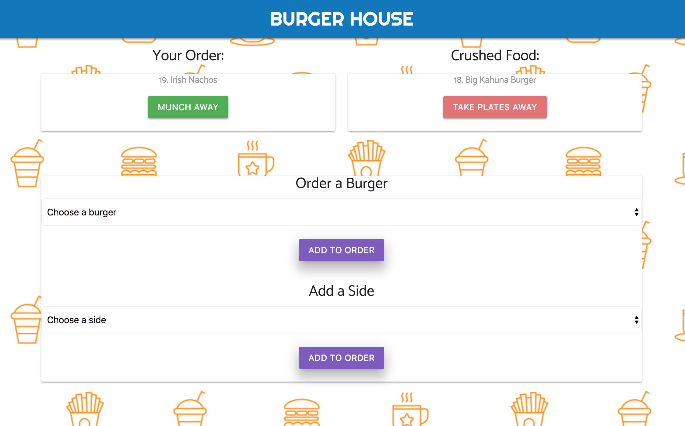
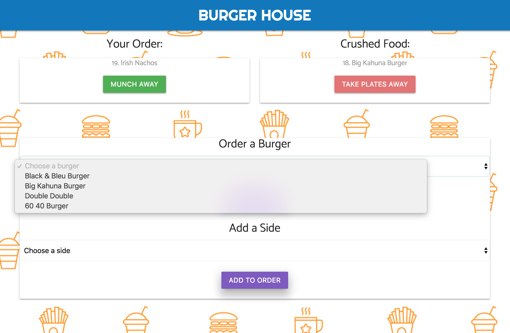
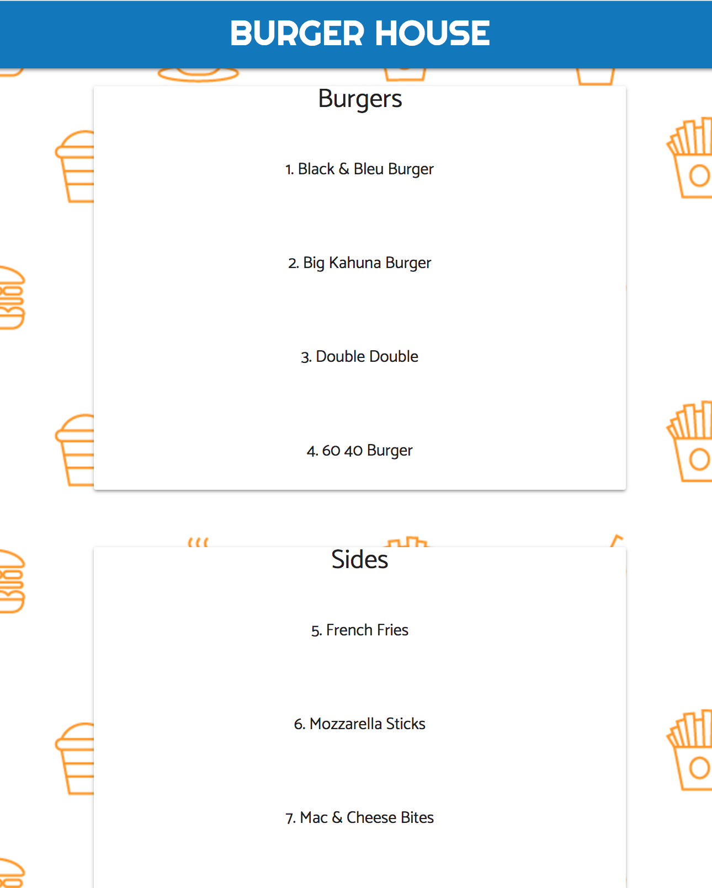

# burger
Eatin Burgers at the Burger House, brah

Created for Week 14 HW of DU Coding Bootcamp. Create a Burger App using Node Express Handlebars and our own ORM. It uses the MVC design pattern, Node and MySQL to query and route data to the app and Handlebars to generate the HTML.

## Getting Started
https://safe-ocean-28903.herokuapp.com/

## Screen Shots

Main Page

Drop Down menu and showing how to click Eat or Remove

Menu Page

## Technologies used
Node.js
MySQL
Handlebars - http://handlebarsjs.com/
body-parser NPM Package - https://www.npmjs.com/package/inquirer
express NPM Package - https://www.npmjs.com/package/express
mysql NPM Package - https://www.npmjs.com/package/mysql
handlebars NPM Package - https://www.npmjs.com/package/handlebars
express-handlbars NPM Package - https://www.npmjs.com/package/express-handlebars

## Prerequisites
- Node.js - Download the latest version of Node https://nodejs.org/en/
- Materialize - Add CDN link http://materializecss.com/getting-started.html

## Built With
Atom - Text Editor
MySql Workbench - Sql editor
Materialize - Wireframe
Heroku - hosting
Github - hosting
